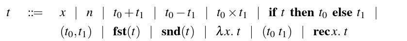
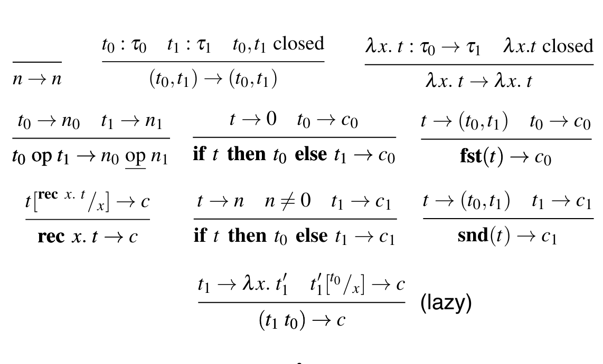

# Hofltex
This program reads an HOFL term and produces its derivation tree to a canonical form. The derivation tree is  saved in a tex file as LaTeX code that can be converted to a PDF. The LaTeX rendering is based on the [proof.sty](https://www.logicmatters.net/resources/ndexamples/proofsty.html) package.

## HOFL
HOFL( Higher Order Functional Language) is  a very simple functional language. Hofl terms are described by the following syntax: 



The syntax accepted by hofltex is the same except for the following changes:
- For simplicity lambda terms are introduced by a backslash <b> \ </b>, resembling the syntax used by haskell for anonymous functions
(e.g <b>\x.x*2</b>).
-  For clarity the multiplitcation symbol used is <b>*</b> and not X
- Function application uses the @ symbol.
- A space is needed between rec and the variable name (rec x.t)
- You can put a term between parentheses ()

For example, a map function for tuples is written as:

<b>\f.\x.(f@fst(x),f@snd(x))</b>

## Evalutation
The operational semantics of Hofl are described by the following inference rules:



A term is parsed, and then, using these rules, is evaluated to a canonical form. The evalutation produces a derivation tree which is the output of the program.

# Installatation and Usage
You need to have SWI-Prolog installed to run this program. 
Simply clone this repo 
```bash
$ git clone https://github.com/piazzesiNiccolo/hofltex.git
```
The executable is <b>hofltex.pl</b>.

Run 
```bash
$ bash run_examples.sh
```
to test the program on the files in examples/.

To run the unit tests, execute
```bash
$ bash test.sh
```
If you want to interpret a term directly from the command line just execute the following command
```bash
$ swipl hofltex.pl "<term>"
```
It's important that the term is between quotes, to avoid problems with the shell interpreting it as a command. The output is saved to the file der.tex by default, you can change the name with the -o option 

An alternative is to read the term directly from a file using the <b> -f </b> option:
```bash
$ swipl hofltex.pl -f <filename>
```
I suggest to use the hofl file extension for clarity and simplicity,     but you can use any text based file format.

To view all the available options, use the -h option or run
```bash
$ swipl hofltex.pl
```
without any argument

# Known Issues

- The program adapts the size of the pdf to the size of the derivation tree. For very large term, this might produce unreadable documents. In this case, i suggest to use the -s (short) option to write only the canonical form, without the full tree.

